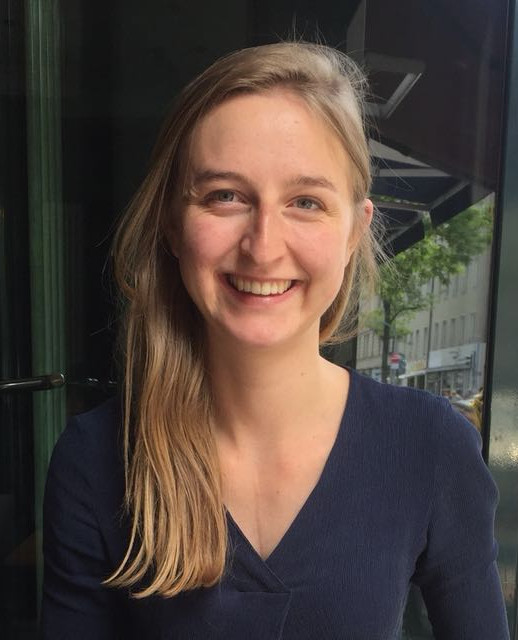

<!-- (comment) the image below can be found in img folder of this very project-->
{: style="float: right; margin: 0px 20px; width: 250px; border-radius: 40%" name="nora"}

<!--  -->

I am Nora Kassner, an incoming  __Research Scientist__ at [__DeepMind__](https://www.deepmind.com/) working on Natural Language Processing. My research focuses on knowledge and reasoning in deep learning models.

Also, I am [__SIGREP__](https://www.sigrep.org/index.html) Secretary for 2022-2024; I am co-organizing the [__Repl4NLP__](https://sites.google.com/view/repl4nlp2023/?pli=1) and [__BigPicture__](https://www.bigpictureworkshop.com/) workshops for 2023; co-led the modeling metadata working group of [__BigScience__](https://bigscience.huggingface.co/) in 2022; and am a member of [__KI macht Schule__](https://ki-macht-schule.de) ("AI for schools").

Before that, I was a Research Scientist at [__Meta AI__](https://ai.facebook.com/) and a PhD student at the University of Munich supervised by [__Hinrich Schütze__](https://scholar.google.com/citations?user=qIL9dWUAAAAJ&hl=en) and supported by the  [__Munich Centre of Machine Learning__](https://mcml.ai/). 

During my PhD interned with the [__Allen Institute for AI__](https://allenai.org/) (AI2) and [__Meta AI__](https://ai.facebook.com/). I recieved AI2's [__Outstanding Intern of the Year Award__](https://allenai.org/outstanding-interns) in 2021.